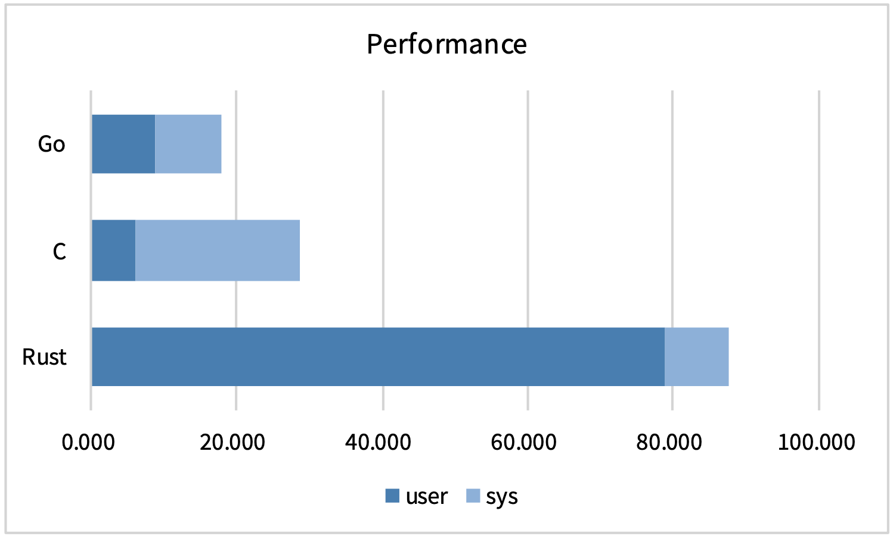
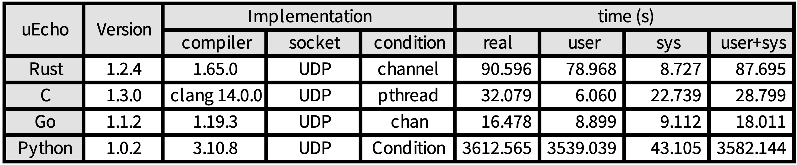
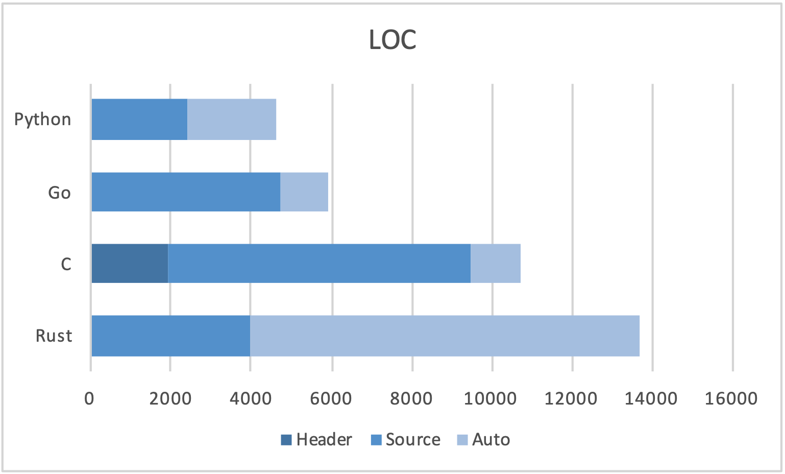
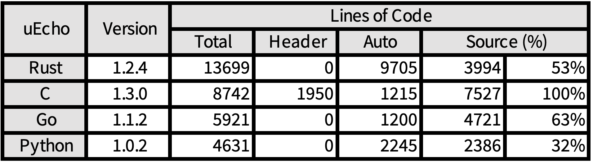

# uecho-bench

`uecho-bench` is a baenchmark utility for evaluation of the following [ECHONET Lite][enet] implementations.

- [uEcho for C](https://github.com/cybergarage/uecho)
- [uEcho for Rust](https://github.com/cybergarage/uecho-rs)
- [uEcho for Go](https://github.com/cybergarage/uecho-go)
- [uEcho for Pyton](https://github.com/cybergarage/uecho-py)

## uecho-bench

`uecho-bench` measures execution times of the uEcho implementations as the following.

`uecho-bench` executes each benchmark program of the uEcho implementations. The benchmark programs try to get all mandatory properties that are included in the found node objects in the local network.

## uecho-loc

`uecho-loc` measures lines of codes (LOCs) of the uEcho implementations as the following.

[enet]:http://echonet.jp/english/
